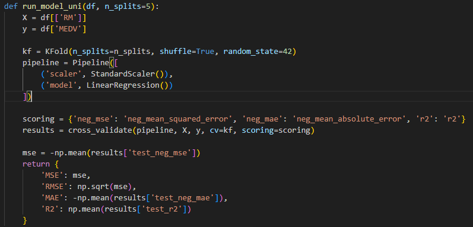
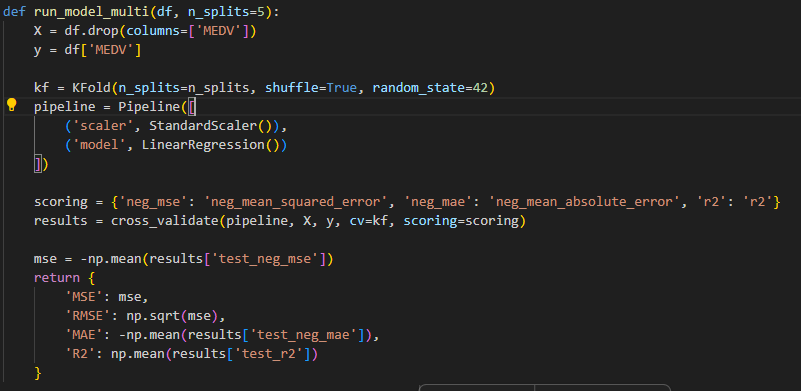
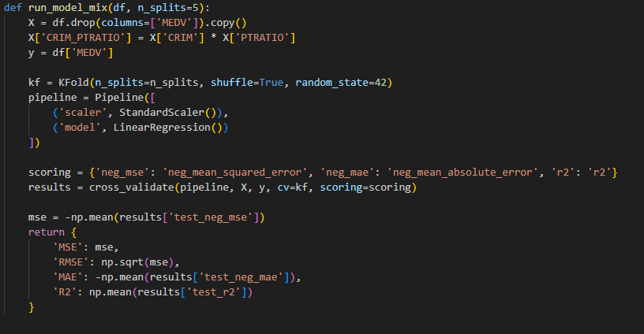
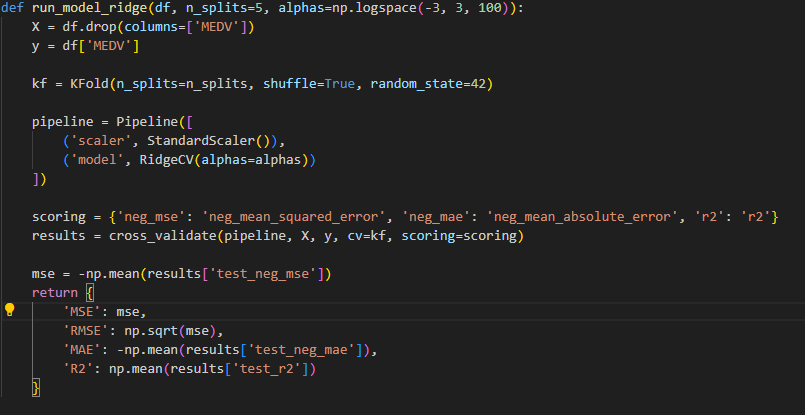
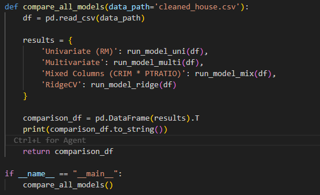
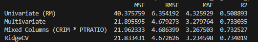

# Boston Housing Price Prediction: Linear Regression Benchmarks

A modular machine learning project designed to evaluate and benchmark **4 Linear Regression modeling strategies** on the Boston Housing dataset. This repository systematically tests feature selection, manual interaction terms, and $L_2$ regularization using 5-fold cross-validation.

---

## 🎯 Project Overview

The goal of this repository is to analyze performance variations across model iterations using standardized 5-fold cross-validation. Models are evaluated across four metrics: **Mean Squared Error (MSE)**, **Root Mean Squared Error (RMSE)**, **Mean Absolute Error (MAE)**, and **Coefficient of Determination ($R^2$)**.

---

## 📁 Repository Structure

```text
├── HousingData.csv         # Raw dataset
├── cleaned_house.csv       # Preprocessed dataset (missing values handled)
├── data_prep.py            # Data cleaning and export pipeline
├── model_uni.py            # Model 1: Univariate Linear Regression (RM)
├── model_multi.py          # Model 2: Multivariate Linear Regression
├── model_Mix_columns.py    # Model 3: Multivariate + Interaction Term
├── model_ridge.py          # Model 4: Ridge Regression with Hyperparameter Tuning (RidgeCV)
├── MSE_Compare.py          # Master cross-validation benchmark script
└── requirements.txt        # Python dependencies
```

---

## 🧹 Data Pipeline (`data_prep.py`)

The dataset contains U.S. Census Bureau housing metrics for Boston, MA. The target variable is `MEDV` (median value of owner-occupied homes in $1000s).

1. **Load Raw Data**: Imports `HousingData.csv`.
2. **Handle Missing Values**: Removes incomplete rows via `.dropna()`.
3. **Reset Indexing**: Normalizes row indices using `.reset_index(drop=True)`.
4. **Export Clean Dataset**: Saves output to `cleaned_house.csv` to ensure consistent data loading across all downstream model scripts.

* **Input**: `HousingData.csv`
* **Output**: `cleaned_house.csv`

---

## 🔬 Model Specifications & Implementation

Every model function accepts a DataFrame and cross-validation fold count, standardizing features through a scikit-learn `Pipeline` (`StandardScaler` + model estimator).

### 1️⃣ Model 1: Univariate Linear Regression (`model_uni.py`)
* **Strategy**: Establishes a baseline using only the single feature most correlated with price (`RM` - average number of rooms per dwelling).
* **Predictors ($X$)**: `df[['RM']]`
* **Target ($y$)**: `df['MEDV']`
* **Architecture**: `KFold(n_splits=5, shuffle=True, random_state=42)` paired with `Pipeline([('scaler', StandardScaler()), ('model', LinearRegression())])`.



---

### 2️⃣ Model 2: Multivariate Linear Regression (`model_multi.py`)
* **Strategy**: Expands features from a single predictor to all 13 available numerical variables.
* **Predictors ($X$)**: `df.drop(columns=['MEDV'])` (13 features)
* **Target ($y$)**: `df['MEDV']`
* **Architecture**: Evaluates overall linear relationship across all primary metrics.



---

### 3️⃣ Model 3: Feature Interaction (`model_Mix_columns.py`)
* **Strategy**: Evaluates manual feature engineering by constructing a multiplicative interaction term combining crime rate (`CRIM`) and pupil-teacher ratio (`PTRATIO`).
* **Predictors ($X$)**: All 13 base features + `X['CRIM_PTRATIO'] = X['CRIM'] * X['PTRATIO']` (14 total features).
* **Target ($y$)**: `df['MEDV']`



---

### 4️⃣ Model 4: Ridge Regression CV (`model_ridge.py`)
* **Strategy**: Addresses feature collinearity and potential overfitting by applying $L_2$ regularization with automated parameter selection ($\alpha$).
* **Predictors ($X$)**: `df.drop(columns=['MEDV'])` (13 features)
* **Target ($y$)**: `df['MEDV']`
* **Search Space**: Evaluates 100 log-spaced candidate regularization parameters ($\alpha \in [10^{-3}, 10^3]$) via `RidgeCV`.



---

### 5️⃣ Master Comparison Script (`MSE_Compare.py`)
Executes all four model workflows sequentially, computes 5-fold cross-validation metrics, formats results into an aggregated comparison table, and generates visualization plots.



---

## 📊 Benchmark Results

Evaluated using 5-fold cross-validation (`random_state=42`):

| Model Strategy | MSE ↓ | RMSE ↓ | MAE ↓ | $R^2$ ↑ |
| :--- | :---: | :---: | :---: | :---: |
| **Univariate (`RM`)** | 40.3758 | 6.3542 | 4.3259 | 0.5089 |
| **Multivariate** | 21.8956 | 4.6793 | 3.2798 | 0.7330 |
| **Interaction (`CRIM * PTRATIO`)** | 21.9623 | 4.6864 | 3.2675 | 0.7325 |
| **RidgeCV** | **21.8334** | **4.6726** | **3.2346** | **0.7340** |



---

## 📈 Key Insights & Performance Analysis

* **Univariate vs. Multivariate**: Moving from a single feature (`RM`) to all 13 features reduces MSE by ~45.8% (from 40.38 to 21.90) and increases $R^2$ from 50.9% to 73.3%, showing that single-variable models miss crucial economic and demographic factors.
* **Impact of Interaction Terms**: Adding `CRIM * PTRATIO` slightly increased MSE (21.8956 vs 21.9623). Unguided feature multiplication can introduce redundant variance without adding explanatory signal.
* **Ridge Regularization**: RidgeCV achieved the best overall performance across all metrics (MSE: 21.8334, $R^2$: 0.7340). Shrinking regression coefficients stabilizes estimation in the presence of collinear variables (such as `TAX` and `RAD`).

---

## 🚀 Getting Started

### 1. Clone Repository & Set Up Virtual Environment:

```bash
git clone https://github.com/cibrgine/boston-housing-price-prediction.git
cd boston-housing-price-prediction
python -m venv venv
source venv/bin/activate  # On Windows use: venv\Scripts\activate
```

### 2. Install Dependencies:

```bash
pip install -r requirements.txt
```

### 3. Run Preprocessing Pipeline:

```bash
python data_prep.py
```

### 4. Execute Benchmark Evaluation:

```bash
python MSE_Compare.py
```
